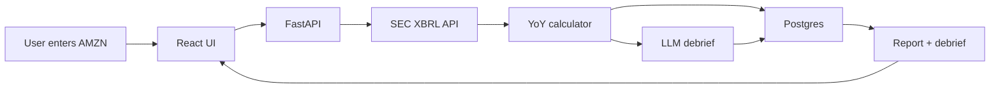

# Earnings Helper

Year-over-year income-statement analysis for public companies. Search a ticker, pull SEC XBRL data, compute the changes in Python, and show a short LLM debrief of what moved.

The app is two screens: a search landing page, and a report with quarterly and annual tables plus the debrief. Postgres caches a report for the latest filing so repeat lookups stay fast.

## Architecture


```mermaid
flowchart LR
    User["User enters AMZN"]
    Frontend["React UI"]
    API["FastAPI"]
    SEC["SEC XBRL API"]
    Calc["YoY calculator"]
    DB["Postgres"]
    LLM["LLM debrief"]
    Report["Report + debrief"]

    User --> Frontend --> API
    API --> SEC --> Calc
    Calc --> DB
    Calc --> LLM
    LLM --> DB
    DB --> Report --> Frontend
```

| Decision | Choice | Why |
|---|---|---|
| Data source | SEC XBRL API | Free, structured JSON |
| YoY math | Deterministic Python | Auditable; the model never does arithmetic |
| LLM | Debrief only | Interprets numbers already computed |
| Database | Postgres | Cache reports and debriefs |
| Deploy | One Render web service | FastAPI serves the built UI and `/api` |

## Run locally

Prerequisites: Python 3.11+, Node.js 18+, pnpm, uv, and a Postgres database.

```bash
cd backend
cp .env.example .env   # SEC_USER_AGENT, DATABASE_URL, OPENAI_API_KEY
uv sync
uv run alembic upgrade head

# from the repo root
./dev.sh
```

`dev.sh` starts the API on port 8000 and Vite on port 5173. Leave `VITE_API_BASE_URL` empty so the dev server proxies `/api`.

Open http://localhost:5173 and search for a ticker such as AMZN.

Tests:

```bash
cd backend && uv run pytest -v -m "not integration"
```

## Environment

Backend (`backend/.env`):

| Variable | Required | Description |
|---|---|---|
| `SEC_USER_AGENT` | yes | Contact string for SEC requests |
| `DATABASE_URL` | yes | Postgres URL. Use the direct connection (port 5432) for migrations |
| `OPENAI_API_KEY` | yes | Debrief generation |
| `OPENAI_MODEL` | no | Defaults to `gpt-4o-mini` |
| `CORS_ORIGINS` | no | Defaults to `http://localhost:5173`. Not needed when the UI is same-origin |
| `LANGFUSE_PUBLIC_KEY`, `LANGFUSE_SECRET_KEY`, `LANGFUSE_BASE_URL` | no | Observability |

Frontend: `VITE_API_BASE_URL` stays empty for local dev and for the single Render service. Set it only if the API is hosted on a different origin.

## Deploy on Render

One web service, defined in [`render.yaml`](render.yaml) and [`Dockerfile`](Dockerfile).

1. Create a Blueprint from this repo, or a Docker web service with root directory `.`.
2. Set `SEC_USER_AGENT`, `DATABASE_URL`, and `OPENAI_API_KEY`. Add `OPENAI_MODEL` and Langfuse keys if you use them.
3. Render runs `alembic upgrade head` before each deploy, then starts uvicorn. The image build compiles `frontend/dist`, and FastAPI serves it next to `/api`.
4. Health check: `GET /health`.

`VITE_API_BASE_URL` and `CORS_ORIGINS` are not required for this setup.

## Project layout

```
backend/     FastAPI app, Alembic, YoY pipeline
frontend/    Vite React app
scripts/     render-build.sh and start.sh
Dockerfile   Node build stage + Python runtime
render.yaml  single web service
dev.sh       local API + Vite
```

API:

| Endpoint | Purpose |
|---|---|
| `GET /api/search?q=amazon` | Ticker and name autocomplete |
| `GET /api/report?ticker=AMZN` | YoY report and debrief, from cache when fresh |
| `GET /api/report?ticker=AMZN&refresh=true` | Recompute and write a new debrief |
| `GET /api/report/stream?ticker=AMZN` | Same pipeline as server-sent progress events |
| `GET /health` | Process health |

## Known limitations

Some filers do not publish a single Operating Expenses XBRL tag. The calculator tries fallbacks in [`backend/config/metrics.yaml`](backend/config/metrics.yaml), but SG&A is not always the same as total operating expenses. When a company fails that row, add the tag they use to the fallback list.
